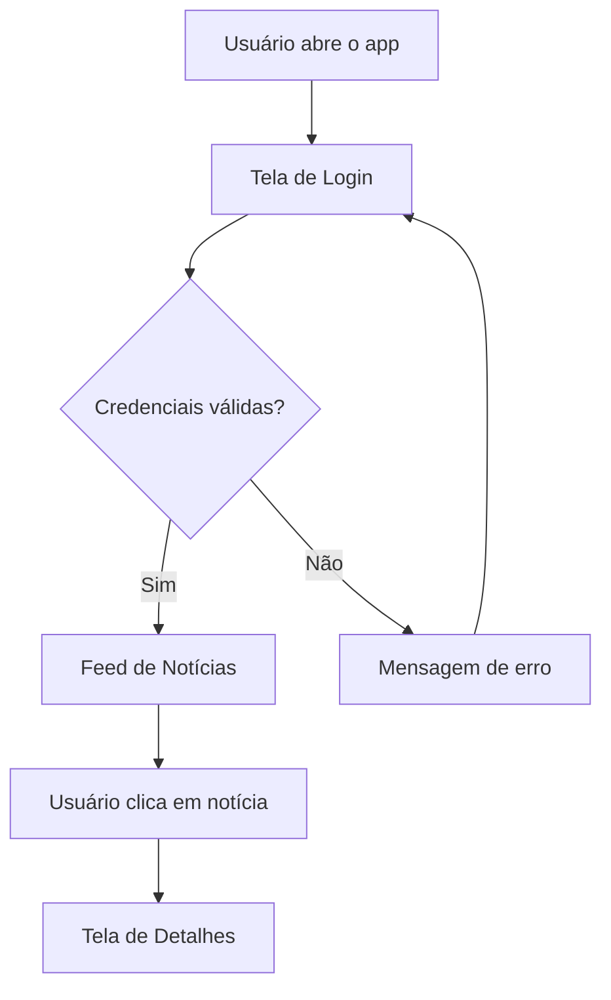
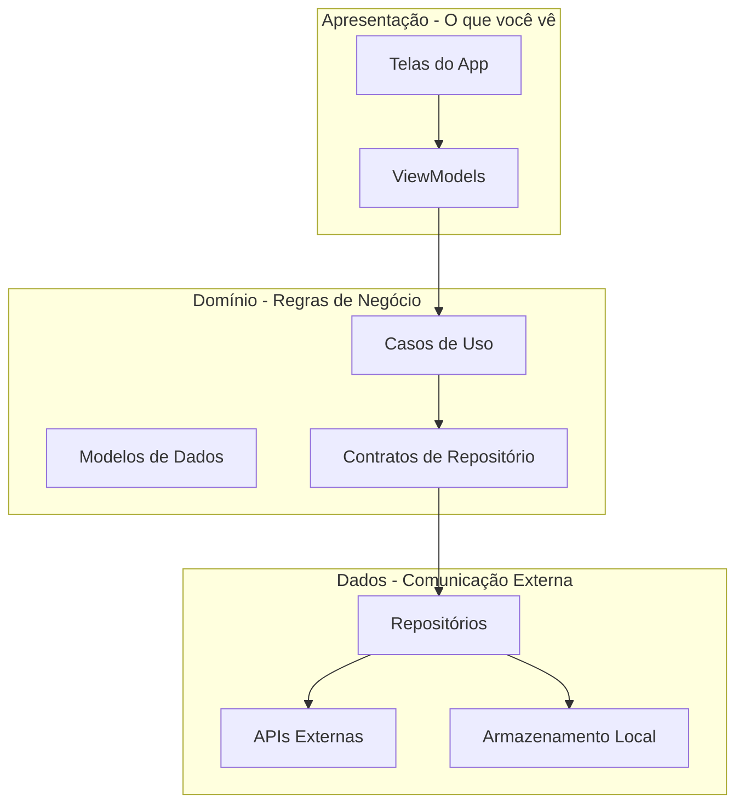
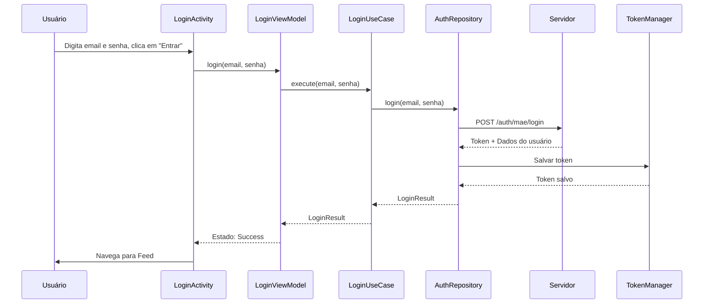
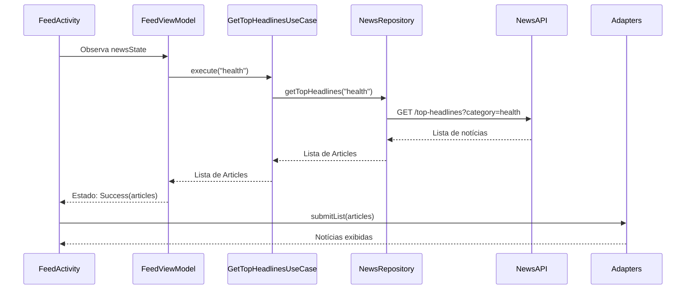

# Documentação do Projeto UndergraduateResearch

## Funcionalidades Principais

### 1. Sistema de Login
- Permite que usuários façam login com email e senha
- Guarda as credenciais de forma segura no dispositivo
- Valida se o usuário está autorizado a usar o aplicativo

### 2. Feed de Notícias
- Mostra notícias de saúde atualizadas
- Apresenta as notícias em dois formatos:
  - **Carrossel**: As 5 notícias principais em destaque no topo
  - **Lista**: Todas as notícias em uma lista rolável
- Permite clicar em uma notícia para ver mais detalhes

### 3. Visualização de Detalhes
- Ao clicar em uma notícia, abre uma tela com informações completas
- Mostra imagem, título, descrição e conteúdo completo

## Como o Aplicativo Funciona?

### Fluxo do Usuário



**Explicação do fluxo:**

1. **Abertura do App**: Quando você abre o aplicativo, a primeira tela que aparece é a de login
2. **Login**: Você digita seu email e senha
3. **Validação**: O app verifica com um servidor se suas credenciais estão corretas
4. **Feed**: Se estiver tudo certo, você é levado para o feed de notícias
5. **Detalhes**: Ao clicar em qualquer notícia, você vê os detalhes completos

## Arquitetura do Projeto

O projeto usa uma arquitetura chamada **MVVM** (Model-View-ViewModel) com **Clean Architecture**. Isso pode parecer complicado, mas é apenas uma forma organizada de separar as responsabilidades do código.

### Camadas da Arquitetura

Imagine o aplicativo como uma casa de três andares:



#### 1. Camada de Apresentação (presentation)

**O que é**: É tudo que o usuário vê e interage - as telas do aplicativo.

**Componentes:**
- **Activities**: As telas propriamente ditas
  - `LoginActivity`: Tela de login
  - `FeedActivity`: Tela do feed de notícias
  - `NewsDetailActivity`: Tela de detalhes da notícia
  - `RegisterActivity`: Tela de cadastro

- **ViewModels**: Gerenciam os dados que aparecem nas telas
  - `LoginViewModel`: Gerencia o processo de login
  - `FeedViewModel`: Gerencia a lista de notícias

- **Adapters**: Transformam dados em elementos visuais
  - `NewsAdapter`: Transforma notícias em itens de lista
  - `NewsCarouselAdapter`: Transforma notícias em cards do carrossel

**Como funciona**: Quando você clica em "Entrar", a `LoginActivity` pede ao `LoginViewModel` para fazer o login. O ViewModel processa tudo e avisa a Activity quando terminar.

#### 2. Camada de Domínio (domain)

**O que é**: Contém as regras de negócio - o "cérebro" do aplicativo que decide o que pode ou não pode ser feito.

**Componentes:**

- **Modelos (model)**: Representam os dados do aplicativo
  - `User`: Representa um usuário (id, email, nome)
  - `Article`: Representa uma notícia (título, descrição, imagem, etc.)
  - `LoginResult`: Resultado do login (token de acesso + dados do usuário)

- **Casos de Uso (usecase)**: Ações específicas que o app pode fazer
  - `LoginUseCase`: Executa o processo de login
  - `GetTopHeadlinesUseCase`: Busca as principais notícias

- **Repositórios (repository - interfaces)**: Contratos que definem como buscar dados
  - `AuthRepository`: Define como fazer autenticação
  - `NewsRepository`: Define como buscar notícias

**Como funciona**: Os casos de uso são como "comandos" específicos. Por exemplo, o `LoginUseCase` sabe exatamente o que fazer quando alguém tenta fazer login: pegar email e senha, enviar para o servidor, guardar o token, etc.

#### 3. Camada de Dados (data)

**O que é**: Responsável por buscar e guardar dados, seja na internet ou no próprio celular.

**Componentes:**

- **Repositórios (repository - implementações)**:
  - `AuthRepositoryImpl`: Implementa a autenticação de verdade
  - `NewsRepositoryImpl`: Implementa a busca de notícias de verdade

- **APIs Remotas (remote/api)**:
  - `AuthApiService`: Define como se comunicar com o servidor de autenticação
  - `NewsApiService`: Define como se comunicar com o servidor de notícias
  - `RetrofitClient`: Configura a comunicação com servidores

- **DTOs (remote/dto)**: Formatos de dados que vêm do servidor
  - `LoginRequestDto`: Formato para enviar dados de login
  - `LoginResponseDto`: Formato que o servidor retorna após login
  - `NewsResponseDto`: Formato das notícias que vêm do servidor
  - `ArticleDto`: Formato de cada notícia individual

- **Armazenamento Local (local)**:
  - `TokenManager`: Guarda e recupera o token de autenticação de forma segura

**Como funciona**: Quando você faz login, o `AuthRepositoryImpl` usa o `AuthApiService` para enviar seus dados ao servidor. Quando recebe a resposta, usa o `TokenManager` para guardar o token de forma segura no celular.

## Estrutura de Pastas

```
app/src/main/java/com/example/undergraduateresearch/
│
├── data/                          # Camada de Dados
│   ├── local/                     # Armazenamento no celular
│   │   └── TokenManager.kt        # Guarda tokens de forma segura
│   ├── remote/                    # Comunicação com servidores
│   │   ├── api/                   # Definições de APIs
│   │   │   ├── AuthApiService.kt
│   │   │   ├── NewsApiService.kt
│   │   │   └── RetrofitClient.kt
│   │   └── dto/                   # Formatos de dados do servidor
│   │       ├── LoginRequestDto.kt
│   │       ├── LoginResponseDto.kt
│   │       ├── NewsResponseDto.kt
│   │       └── ArticleDto.kt
│   └── repository/                # Implementações de repositórios
│       ├── AuthRepositoryImpl.kt
│       └── NewsRepositoryImpl.kt
│
├── domain/                        # Camada de Domínio (Regras de Negócio)
│   ├── model/                     # Modelos de dados
│   │   ├── User.kt
│   │   ├── Article.kt
│   │   └── LoginResult.kt
│   ├── repository/                # Contratos de repositórios
│   │   ├── AuthRepository.kt
│   │   └── NewsRepository.kt
│   └── usecase/                   # Casos de uso
│       ├── LoginUseCase.kt
│       └── GetTopHeadlinesUseCase.kt
│
├── presentation/                  # Camada de Apresentação (Interface)
│   ├── login/                     # Tela de Login
│   │   ├── LoginActivity.kt
│   │   └── LoginViewModel.kt
│   ├── feed/                      # Tela de Feed
│   │   ├── FeedActivity.kt
│   │   ├── FeedViewModel.kt
│   │   └── adapter/               # Adaptadores de lista
│   │       ├── NewsAdapter.kt
│   │       └── NewsCarouselAdapter.kt
│   ├── newsdetail/                # Tela de Detalhes
│   │   └── (arquivos de detalhes)
│   ├── register/                  # Tela de Cadastro
│   │   └── (arquivos de cadastro)
│   └── ViewModelFactory.kt        # Cria ViewModels
│
├── di/                            # Injeção de Dependências
│   └── AppContainer.kt            # Container de dependências
│
├── util/                          # Utilitários
│   └── Resource.kt                # Gerencia estados (Loading, Success, Error)
│
└── UndergraduateResearchApplication.kt  # Classe principal do app
```

## Fluxo de Dados 

### 1: Como funciona o Login



**Passo a passo:**

1. **Você digita email e senha e clica em "Entrar"** na tela de login
2. **LoginActivity** captura o clique e pede ao **LoginViewModel** para fazer o login
3. **LoginViewModel** chama o **LoginUseCase** (caso de uso de login)
4. **LoginUseCase** usa o **AuthRepository** para fazer a autenticação
5. **AuthRepository** envia uma requisição ao **Servidor** com email e senha
6. **Servidor** valida e retorna um token de acesso + dados do usuário
7. **AuthRepository** pede ao **TokenManager** para guardar o token de forma segura
8. **TokenManager** salva o token usando criptografia
9. Os dados voltam pela mesma cadeia até chegar no **LoginViewModel**
10. **LoginViewModel** avisa a **LoginActivity** que deu certo
11. **LoginActivity** mostra uma mensagem de boas-vindas e navega para o Feed

### 2: Como funciona o Feed de Notícias



**Passo a passo:**

1. **FeedActivity** abre e começa a observar o estado das notícias
2. **FeedViewModel** automaticamente pede ao **GetTopHeadlinesUseCase** para buscar notícias
3. **GetTopHeadlinesUseCase** usa o **NewsRepository** para buscar notícias de saúde
4. **NewsRepository** faz uma requisição à **NewsAPI** (servidor de notícias)
5. **NewsAPI** retorna uma lista de notícias em formato JSON
6. **NewsRepository** converte o JSON em objetos `Article`
7. Os dados voltam até o **FeedViewModel**
8. **FeedViewModel** atualiza o estado para "Success" com a lista de notícias
9. **FeedActivity** recebe a atualização e passa as notícias para os **Adapters**
10. **Adapters** transformam cada notícia em elementos visuais (cards)
11. As notícias aparecem na tela!

## Tecnologias Utilizadas

### Linguagem
- **Kotlin**: Linguagem de programação moderna para Android

### Bibliotecas Principais

#### 1. Retrofit
**O que faz**: Facilita a comunicação com servidores na internet
**Como usa**: Transforma chamadas de API em código Kotlin simples

#### 2. Gson
**O que faz**: Converte dados JSON (formato de texto) em objetos Kotlin
**Como usa**: Quando o servidor envia dados, o Gson transforma em objetos que o app entende

#### 3. OkHttp
**O que faz**: Gerencia conexões de internet
**Como usa**: Adiciona logs para debug e gerencia requisições HTTP

#### 4. Glide
**O que faz**: Carrega imagens da internet
**Como usa**: Baixa e exibe as imagens das notícias

#### 5. Security Crypto
**O que faz**: Criptografa dados sensíveis
**Como usa**: Guarda o token de autenticação de forma segura

#### 6. Lifecycle (ViewModel e LiveData)
**O que faz**: Gerencia o ciclo de vida das telas
**Como usa**: Garante que os dados sobrevivam quando você gira a tela

#### 7. Coroutines
**O que faz**: Permite executar tarefas em segundo plano
**Como usa**: Busca dados da internet sem travar a interface

#### 8. RecyclerView
**O que faz**: Cria listas eficientes
**Como usa**: Exibe a lista de notícias de forma otimizada

#### 9. ViewPager2
**O que faz**: Cria carrosséis deslizantes
**Como usa**: Mostra as notícias principais em um carrossel no topo

## Componentes Importantes

### 1. UndergraduateResearchApplication

**O que é**: A classe principal que inicia o aplicativo

**O que faz**:
- Cria o `AppContainer` quando o app inicia
- Gerencia dependências globais do aplicativo

### 2. AppContainer

**O que é**: Um "container" que guarda todas as dependências do app

**O que faz**:
- Cria e mantém instâncias únicas de:
  - APIs (AuthApiService, NewsApiService)
  - Repositórios (AuthRepository, NewsRepository)
  - Casos de Uso (LoginUseCase, GetTopHeadlinesUseCase)
  - TokenManager
- Garante que todos usem as mesmas instâncias (padrão Singleton)

**Por que é importante**: Evita criar múltiplas cópias dos mesmos objetos, economizando memória

### 3. ViewModelFactory

**O que é**: Uma fábrica que cria ViewModels

**O que faz**:
- Permite passar dependências para os ViewModels
- Garante que os ViewModels sejam criados corretamente

### 4. Resource

**O que é**: Uma classe utilitária que representa estados

**Estados possíveis**:
- `Loading`: Carregando dados
- `Success`: Dados carregados com sucesso
- `Error`: Erro ao carregar dados

**Por que é útil**: Permite que as telas saibam exatamente o que está acontecendo e mostrem a interface apropriada (loading, conteúdo ou erro)

### 5. TokenManager

**O que é**: Gerenciador de tokens de autenticação

**O que faz**:
- Salva o token de forma criptografada
- Lê o token quando necessário
- Limpa o token quando o usuário faz logout

**Como funciona**: Usa a biblioteca Security Crypto do Android para criptografar os dados antes de salvar

## Configurações do Projeto

### build.gradle.kts

Este arquivo configura como o projeto é compilado:

- **Versão mínima do Android**: API 24 (Android 7.0)
- **Versão alvo**: API 36 (Android mais recente)
- **Java Version**: 11
- **View Binding**: Ativado (facilita acessar elementos da interface)

### AndroidManifest.xml

Define configurações do aplicativo:

- **Permissões**: Internet (para buscar notícias e fazer login)
- **Tela inicial**: LoginActivity
- **Outras telas**: FeedActivity, NewsDetailActivity, RegisterActivity
- **Tráfego HTTP**: Permitido (para desenvolvimento)